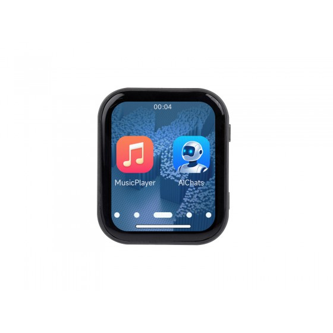

  <h1>ESP32-S3-Touch-LCD-1.83</h1>
  
<strong>ESP32-S3 1.83-inch 240 × 284 IPS capacitive-touch development board</strong>

  

    
    
    
  

  
<a href="README_ZH.md">简体中文</a>

  

  

    <a href="https://www.waveshare.com/product/esp32-s3-touch-lcd-1.83.htm">🌐 Product</a> |
    <a href="https://docs.waveshare.com/ESP32-S3-Touch-LCD-1.83">📚 Documentation</a> |
    <a href="firmware/">📦 Factory Firmware</a> |
    <a href="examples/esp-idf/">🧩 ESP-IDF</a> |
    <a href="examples/arduino/">🔧 Arduino</a>
  

---

## ✨ Overview

This repository provides first-party ESP-IDF and Arduino examples, factory recovery firmware, schematics, video assets, and maintainer documentation for the Waveshare ESP32-S3-Touch-LCD-1.83.

The board combines an ESP32-S3 with a compact display and touch interface, power management, motion sensing, real-time clock, audio, microSD storage, and USB connectivity.

## 🖥️ Hardware overview

| Feature | Device / interface |
| --- | --- |
| MCU | ESP32-S3R8 with 8 MB PSRAM and 16 MB flash |
| Display | 1.83-inch 240 × 284 IPS LCD using ST7789P over SPI |
| Touch | CST816-family capacitive touch controller over I2C |
| Power management | AXP2101 |
| Motion sensor | QMI8658 six-axis IMU |
| RTC | PCF85063 |
| Audio | ES8311 codec and ES7210 ADC |
| Storage and connectivity | microSD, USB, I2C, and UART |
| Board support | Managed component `waveshare/esp32_s3_touch_lcd_1_83` |
| Hardware files | [Schematic](schematic/) and [video assets](videos/) |

Hardware-facing changes require schematic-backed validation; a successful build proves compilation, not pin correctness.

## 📦 Firmware and recovery

[`firmware/`](firmware/) contains the checked-in factory recovery image. It is an immutable delivery artifact, not a source project, and is excluded from example CI. Routine documentation and CI changes must not rebuild, repackage, rename, or modify it.

Source-built CI artifacts are diagnostics for selected examples. They do not replace or validate factory firmware. See [firmware notes](docs/firmware.md).

## 🧪 Examples

### ESP-IDF

| Example | Focus |
| --- | --- |
| [01_AXP2101](examples/esp-idf/01_AXP2101/) | Power management and battery telemetry |
| [02_lvgl_demo_v9](examples/esp-idf/02_lvgl_demo_v9/) | LVGL 9 display demo |
| [03_esp-brookesia](examples/esp-idf/03_esp-brookesia/) | ESP-Brookesia application UI |
| [04_Immersive_block](examples/esp-idf/04_Immersive_block/) | Motion-driven interactive demo |
| [05_Spec_Analyzer](examples/esp-idf/05_Spec_Analyzer/) | Audio spectrum analyzer |
| [06_videoplayer](examples/esp-idf/06_videoplayer/) | Video playback |

### Arduino

| Example | Focus |
| --- | --- |
| [01_HelloWorld](examples/arduino/01_HelloWorld/) | Display bring-up |
| [02_Drawing_board](examples/arduino/02_Drawing_board/) | Touch drawing |
| [03_GFX_AsciiTable](examples/arduino/03_GFX_AsciiTable/) | GFX text rendering |
| [04_GFX_ESPWiFiAnalyzer](examples/arduino/04_GFX_ESPWiFiAnalyzer/) | Wi-Fi scan visualization |
| [05_GFX_Clock](examples/arduino/05_GFX_Clock/) | Clock display |
| [06_GFX_PCF85063_simpleTime](examples/arduino/06_GFX_PCF85063_simpleTime/) | PCF85063 RTC display |
| [07_LVGL_PCF85063_simpleTime](examples/arduino/07_LVGL_PCF85063_simpleTime/) | LVGL RTC UI |
| [08_LVGL_QMI8658_ui](examples/arduino/08_LVGL_QMI8658_ui/) | LVGL IMU data UI |
| [09_LVGL_Arduino](examples/arduino/09_LVGL_Arduino/) | LVGL touch UI |

Bundled Arduino libraries live under [`examples/arduino/libraries/`](examples/arduino/libraries/). Their upstream examples remain available for reference but are not first-party product CI targets.

## 🛠️ Toolchains and CI

CI builds all six ESP-IDF projects with ESP-IDF `v5.5.5` and `v6.0.2`, and all nine Arduino sketches with Arduino-ESP32 `3.3.11` using `esp32:esp32:esp32s3:FlashMode=qio,FlashSize=16M,PSRAM=opi,USBMode=hwcdc,PartitionScheme=default`. This matches the ESP32-S3R8 board configuration: 16 MB flash, octal PSRAM, QIO flash mode, and the default partition scheme.

Every pull request receives a lightweight scope and static-check result. Documentation-only changes select no product builds; direct example changes select only the affected project or sketch; shared build inputs select the applicable full matrix. Empty or unavailable diff data fails closed. See [CI documentation](docs/ci.md).

## 🗂️ Repository structure

| Path | Purpose |
| --- | --- |
| [`examples/esp-idf/`](examples/esp-idf/) | First-party ESP-IDF projects |
| [`examples/arduino/`](examples/arduino/) | First-party Arduino sketches and bundled libraries |
| [`config/`](config/) | CI policy and shared configuration |
| [`docs/`](docs/) | Repository, CI, component, firmware, and compatibility notes |
| [`firmware/`](firmware/) | Immutable factory flashing and recovery image |
| [`releases/`](releases/) | Source-built example artifact helpers |
| [`schematic/`](schematic/) | Public schematic files |
| [`videos/`](videos/) | Media assets used by video examples |

## 📚 Documentation and support

- [Repository structure](docs/repository-structure.md)
- [Continuous integration](docs/ci.md)
- [Components](docs/components.md)
- [Firmware artifacts](docs/firmware.md)
- [ESP-Brookesia notes](docs/brookesia.md)
- [Release helpers](releases/README.md)
- [Contributing guide](CONTRIBUTING.md)
- [Support](SUPPORT.md)
- [Security policy](SECURITY.md)
- [Open an issue](https://github.com/waveshareteam/ESP32-S3-Touch-LCD-1.83/issues/new/choose)

## 📄 License

This repository is licensed under the Apache License 2.0; see [LICENSE.txt](LICENSE.txt).
